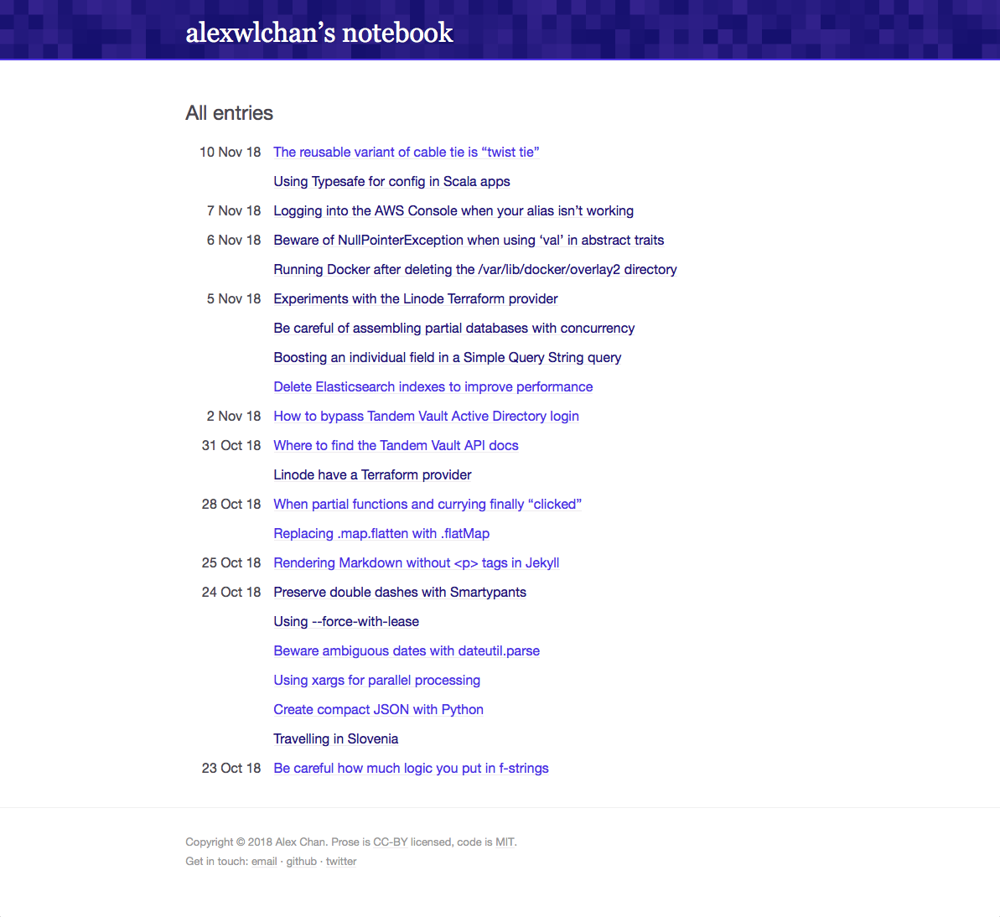

# notebook.alexwlchan.net

This repo has the code for my notebook site, [notebook.alexwlchan.net][root].

My notebook is for short blog posts that I don't think are worth writing up as a full post on my [main site][main], but which are useful information that I want to find later.
I make them public so they can be indexed by Google.
Often it's for solutions to very specific problems.

Not everything will make sense if you're not me -- these are written for me first, and may be missing context or assumptions that I've forgotten I'm making.
On my main blog I try to write those out explicitly, but here I don't bother.

This is a static site built with [Jekyll][jekyll], using a bunch of build machinery taken from my main site.

[root]: https://notebook.alexwlchan.net/
[main]: https://github.com/alexwlchan/alexwlchan.net
[jekyll]: https://jekyllrb.com/

# License

MIT.
